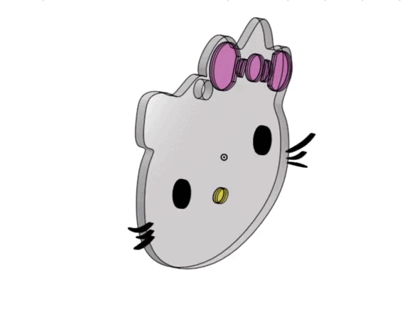

# Hello_Kitty_Keychain

### Project Overview
This repository features a custom 3D model of a Hello Kitty keychain. The design process focused on converting 2D character geometry into a functional, single-body 3D object. Utilizing parametric modeling techniques in Onshape, the keychain was engineered to ensure high geometric stability and seamless compatibility with FDM (Fused Deposition Modeling) 3D printers.

### Visual Preview

### Technical Approach
- Design Philosophy: The model was conceptualized as a monolithic structure to eliminate assembly complexities and ensure print reliability.
- Workflow: Developed from initial sketch vectors, followed by precise extrusions and final geometric optimization to create a "watertight" mesh suitable for high-resolution printing.
- Compatibility: The exported STL file is calibrated for standard 3D slicer environments, including Cura and Bambu Studio.

### Specifications
- Software: Onshape
- File Format: Binary STL (Millimeter-standardized)
- Geometry Type: Solid Single-Body
- Application: Additive Manufacturing

### Usage Guidelines
This model is provided as an open project for personal use. It is recommended to print with a standard infill density to maintain structural integrity while keeping the keychain lightweight.
